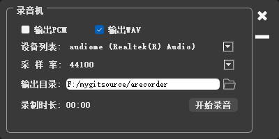

# recorder for desktop
一个桌面端的小录音机



# build
```
cmake -Bbuild_ninja -DQt5_DIR=<qt5 dir> -DFFMPEG_INC_DIR=<ffmpeg include> -DFFMPEG_LIBS_DIR=<ffmpeg libs path>
cmake --build build_ninja

exp:
    cmake -Bbuild_ninja -DQt5_DIR=D:\Qt\Qt5.12.11\5.12.11\msvc2017_64\lib\cmake\Qt5 -DFFMPEG_INC_DIR=D:\commonlib\include -DFFMPEG_LIBS_DIR=D:\commonlib\lib
    cmake -Bbuild_ninja -DQt5_DIR=D:\Qt\Qt5.12.11\5.12.11\msvc2017_64\lib\cmake\Qt5 -DFFMPEG_INC_DIR=D:\commonlib\include -DFFMPEG_LIBS_DIR=D:\commonlib\lib ..\arecorder -GNinja
```

# deps
1.[ffmpeg](https://github.com/ffmpeg/ffmpeg) 抓取音频数据
2.[qt](https://github.com/qt/qt5) 界面

# todos
* 1.目前办法调节采样率,以前在安卓上跑的一段重采样代码，现在不知道windows上需要的参数怎么填
* 2.支持只windows平台，虽然linux也能编译过，但是没研究过怎么获取麦克风